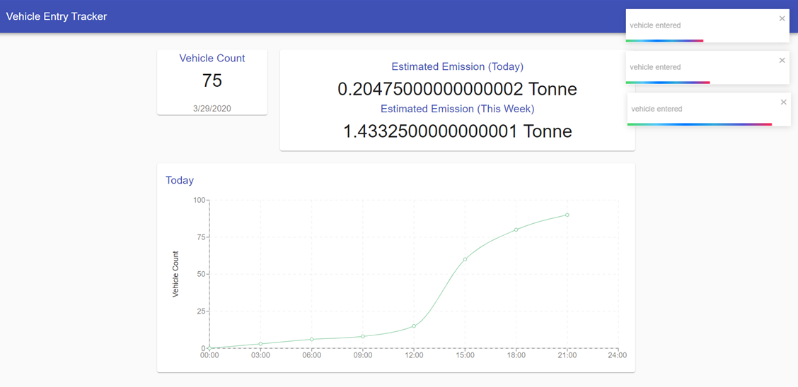
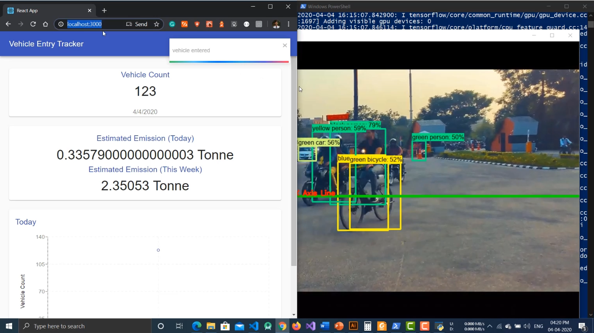

# Vehicle Emission Calculator

An academic project (2nd sem) for CHE110 - Environmental Studies (LPU)

## Project Report:

Checkout the project report in [`Report`](./Report/) directory.

*It was mandatory to create a handwritten project report, pretty strange for a CSE student right? Well, my teammate handled the part 😉*

## Tech Stacks:
- TensorFlow
- OpenCV
- Python
- React.js
- Node.js
- WebSocket
## Screenshots:

    

    

### TensorFlow Object detection API referenced from: https://github.com/ahmetozlu/tensorflow_object_counting_api